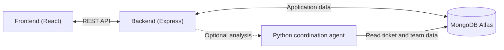

# Paperdesk

Paperdesk is a web application for reporting and managing internal support issues. Employees submit tickets, support staff assign and resolve them, and admins manage users, roles, and teams.

The app includes ticket filtering, profile settings, and notifications about ticket involvement and resolution. An optional AI coordination service identifies teams and people relevant to an incident.

## Architecture

The frontend communicates with the backend using a session cookie. The backend handles permissions and database operations. When coordination is enabled, it calls the Python agent in the background and saves the returned summary, relevant teams, and stakeholders.

## Project parts

| Part | Technology | Responsibility |
| --- | --- | --- |
| [Frontend](frontend/README.md) | React, TypeScript, Vite | Browser interface for login, tickets, notifications, profiles, and administration. |
| [Backend](backend/README.md) | Express, TypeScript, Node.js | REST API, authentication, permissions, ticket management, and notifications. |
| [Coordination agent](agents/README.md) | Python, FastAPI, LangChain | Optional AI analysis that reads incident context and suggests relevant teams and people. |
| [Deployment](k8s/README.md) | Docker images, Kubernetes manifests, k3s | Configuration for running and exposing the frontend and backend on the Raspberry Pi. |
| Database | MongoDB Atlas | Stores users, teams, tickets, sessions, and notifications. |

Each component's linked README contains its setup instructions.

## Current deployment

The frontend and backend run as ARM64 containers on a Raspberry Pi 4 through k3s. Nginx serves the frontend, and Node.js runs the backend. MongoDB Atlas is hosted separately. The optional Python agent is not currently deployed on the Pi.

The current manifests expose the frontend on port `30081` and the API on port `30080`. See the [deployment guide](k8s/README.md) for configuration and deployment steps.
